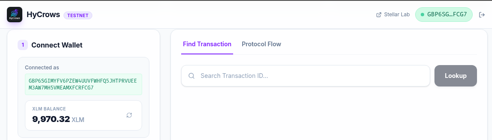
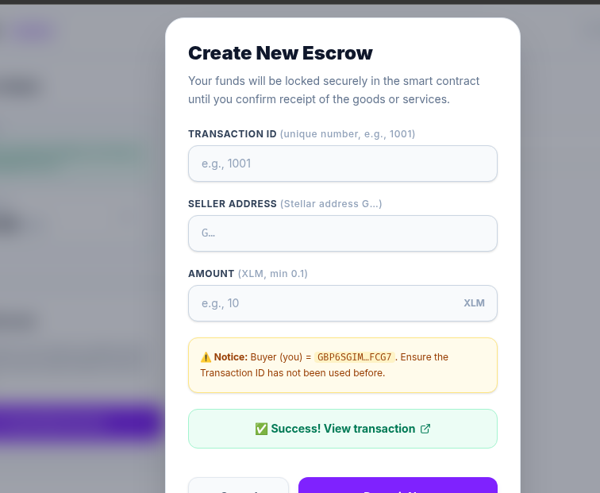
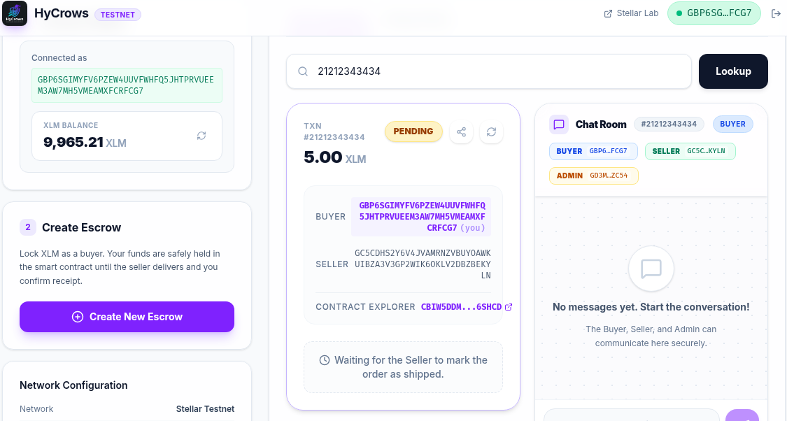

<div align="center">
  
  
  
  
  <h1>🦅 HyCrows Escrow Protocol</h1>
  <p><strong>A Trustless, Automated Web3 Escrow with Anti-Griefing Mechanisms built on Stellar Soroban.</strong></p>
</div>

---

## 🟢 Level 4 - Green Belt Submission Deliverables

This repository fulfills all requirements for the **Level 4 Green Belt** submission of the Stellar Journey to Mastery program.

- **Live Demo Link:** [https://demo-hycrows.vercel.app/](https://demo-hycrows.vercel.app/)
- **Video Demo Link:** [Google Drive](https://drive.google.com/file/d/1Nqs0eki9FEif1Tbe3uorpkIEPi5KVsD0/view?usp=drivesdk) 
- **CI/CD Pipeline Running:** 
- **Mobile Responsive View:** <br/>
  
- **Smart Contract Address:** `CBIW5DDMFROYROSBUBSE2FVTNQ7PCIZOMN2VJNCZI2BYMYWQXKY6SHCD`
- **Inter-Contract Call Example (Transaction Hash):** [View on Stellar Expert](https://stellar.expert/explorer/testnet/contract/CBIW5DDMFROYROSBUBSE2FVTNQ7PCIZOMN2VJNCZI2BYMYWQXKY6SHCD) *(HyCrows leverages the SAC token::Client for XLM transfers, representing native inter-contract calls on Soroban).*

---

## ⚪️ Level 1 - White Belt Submission Deliverables

Per requirements for **Level 1 White Belt**, here are the verification screenshots from the live Testnet dApp:

### 1. Wallet Connected State & XLM Balance Displayed
*Showcases connection to Freighter Wallet on Testnet, displaying the user's current native balance.*


### 2. Successful Testnet Transaction (Deposit)
*Showcases user sending a transaction (deposit escrow) to the smart contract.*


### 3. Transaction Result & Hash Confirmation
*Showcases user feedback showing the confirmed transaction hash or exploration link.*


---

## 💡 Inspiration: The Problem
In the fast-growing digital economy, peer-to-peer (P2P) commerce suffers from a massive **trust deficit**. 
- **Buyers** are afraid to send money first in fear of getting scammed.
- **Sellers** are afraid to send digital goods or services without upfront payment.
- **Current escrow solutions** are centralized, charge high fees, and rely heavily on slow human moderation. 
- **Griefing Attacks**: In traditional crypto escrows, malicious buyers can infinitely stall a seller's payment by opening fake disputes with zero consequences, effectively locking the seller's funds hostage.

## 🧑‍⚖️ For Judges: How to Test Admin Resolution
To fully evaluate the protocol, you can test the **Admin Dispute Resolution** without needing to deploy your own contract. We have created a dedicated Testnet Treasury account for this hackathon:
1. Open your **Freighter Wallet** extension.
2. Click **Settings -> Manage accounts -> Import a Stellar secret key**.
3. Paste the following Testnet Secret Key: 
   `SAGV7T6W5VSGSOGFVNPRUIZ3BGOSL7ZSOY32WD2ZXQIVDSJLQIE6VQLF`
4. Connect this imported wallet to the HyCrows Dashboard. The UI will automatically detect you as the Admin and unlock the **Admin Resolution Dashboard** and dispute override buttons!

## 🟢 Live Deployments (Stellar Testnet)
The HyCrows smart contract is currently live on the Stellar Testnet. You can interact with it directly or through our frontend dashboard.

- **Smart Contract ID**: [`CBIW5DDMFROYROSBUBSE2FVTNQ7PCIZOMN2VJNCZI2BYMYWQXKY6SHCD`](https://stellar.expert/explorer/testnet/contract/CBIW5DDMFROYROSBUBSE2FVTNQ7PCIZOMN2VJNCZI2BYMYWQXKY6SHCD)
- **Treasury (Admin) Address**: `GD3MANCVQZ35HURGSOV6LBF7IP4SU3IPGISHNM3237MCE4IO4NALZC54`
- **Supported Token**: XLM Native (`CDLZFC3SYJYDZT7K67VZ75HPJVIEUVNIXF47ZG2FB2RMQQVU2HHGCYSC`)

## 🚀 What It Does
**HyCrows Escrow Protocol** solves this by introducing a fully decentralized, hybrid-automated smart contract escrow system on the Stellar network. 

It acts as a neutral, trustless middleman holding the funds securely on-chain until the transaction is successfully completed. What makes HyCrows unique is its **Anti-Griefing Staking Mechanism** and its **Off-chain Chat Room integration**.

### 🔥 Key Features
1. **Automated Escrow with Time-Locks**: Once a seller marks an item as "Shipped", a 24-hour timer starts. If the buyer goes silent, anyone can trigger the `auto_release_funds` function, ensuring the seller gets paid. No more funds locked forever due to unresponsive buyers.
2. **Anti-Griefing Dispute Stake**: To prevent malicious buyers from spamming disputes to stall payments, opening a dispute requires the buyer to stake **2 XLM**. 
   - If the buyer is right, they get a full refund + their stake back.
   - If the buyer is lying (Seller wins), the seller gets paid, and the buyer's 2 XLM stake is sent to the **HyCrows Treasury**. This makes griefing financially punishing.
3. **Decentralized Chat Room**: A built-in communication hub tied directly to the Transaction ID, allowing the Buyer, Seller, and Admin to share evidence and resolve disputes without leaving the platform.
4. **Persistent On-Chain Storage**: Built using Soroban's advanced `extend_ttl` logic, ensuring transaction data survives on the ledger for up to a year without being archived.

---

## 🛠 How We Built It (Tech Stack)

The HyCrows ecosystem is composed of two main modules:

### 1. `hycrows-escrow/` (Smart Contract)
- **Language**: Rust
- **Framework**: Soroban SDK v26 (Protocol Version 26)
- **Features**: Event-driven architecture using the `#[contractevent]` macro, rigorous state machine enforcement, and dynamic Time-to-Live (TTL) storage extension to prevent state archiving. Fully unit-tested (10/10 passing tests).

### 2. `hycrows-dashboard/` (Frontend Application)
- **Framework**: Next.js 14, React, Tailwind CSS
- **Web3 Integration**: `@stellar/freighter-api` for wallet connectivity and signing, and `@stellar/stellar-sdk` for reading contract state via gas-free RPC simulations (`simulateTransaction`).
- **Real-time UX**: Implements a 3-second polling mechanism for the Chat Room, optimistic UI updates, and role-based access control (differentiating UI for Buyer, Seller, and Admin).

---

## 🔄 How It Works (Transaction Flow)

1. **Deposit (Status: Pending)**: The Buyer initiates an escrow by depositing XLM. Funds are securely locked in the smart contract.
2. **Fulfillment (Status: Shipped)**: The Seller fulfills the service/product and marks it as shipped. A 24-hour countdown begins.
3. **Completion (Status: Resolved)**: 
   - **Happy Path**: The Buyer confirms receipt, instantly releasing funds to the Seller.
   - **Auto-Release**: If 24 hours pass without Buyer response, the protocol automatically releases funds to the Seller.
4. **Dispute (Status: Disputed)**: If something goes wrong, the Buyer can open a dispute by staking a **2 XLM** anti-griefing fee. Funds are frozen. Both parties submit evidence in the Chat Room.
5. **Resolution (Status: Refunded / Resolved)**: The HyCrows Admin reviews the evidence and resolves the case:
   - **Buyer Wins**: Buyer gets their principal deposit + the 2 XLM stake back.
   - **Seller Wins**: Seller receives the principal deposit. The 2 XLM stake is slashed and sent to the HyCrows Treasury.

---

## 🚀 Getting Started & Local Setup

### Prerequisites
- [Rust](https://rustup.rs/) (v1.84+ recommended with `wasm32v1-none` target)
- [Node.js](https://nodejs.org/) (v18+)
- [Stellar CLI](https://stellar.org/developers/stellar-cli) (v26)
- [Freighter Wallet](https://www.freighter.app/) extension installed on your browser.

### 1. Smart Contract Deployment

```bash
cd hycrows-escrow

# Add the WASM target
rustup target add wasm32v1-none

# Build the contract
cargo build --target wasm32v1-none --release

# Run unit tests
cargo test

# Deploy to Stellar Testnet
stellar contract deploy \
  --wasm target/wasm32v1-none/release/hycrows_escrow.wasm \
  --network testnet \
  --source <YOUR_FUNDED_KEY>
```

After deployment, initialize the contract with the Admin address and the native XLM token address:
```bash
stellar contract invoke \
  --id <YOUR_NEW_CONTRACT_ID> \
  --network testnet \
  --source <YOUR_FUNDED_KEY> \
  -- initialize \
  --admin_address <ADMIN_ADDRESS> \
  --token_address CDLZFC3SYJYDZT7K67VZ75HPJVIEUVNIXF47ZG2FB2RMQQVU2HHGCYSC
```

### 2. Running the Dashboard

```bash
cd hycrows-dashboard

# Install dependencies
npm install

# Set up your environment variables
# Replace the NEXT_PUBLIC_CONTRACT_ID in .env.local with your new Contract ID
cp .env.example .env.local

# Run the development server
npm run dev
```
Open `http://localhost:3000` in your browser to interact with the protocol!

---

## 🏆 Hackathon Notes
We built HyCrows because we noticed a critical flaw in traditional crypto escrows: *griefing*. By leveraging Soroban's highly efficient smart contracts and the speed of the Stellar network, we've created an escrow protocol that protects both buyers and sellers while ensuring bad actors are financially penalized. 

Built with 💜 for the Stellar ecosystem.
